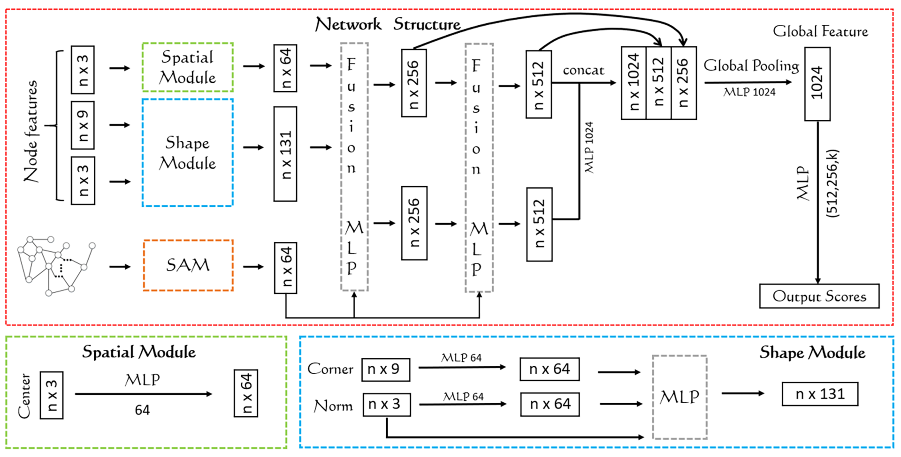

# MeshGraph in PyTorch

Transfroming Mesh data to Mesh Graph Tology through the idea of Finite Element, Paper is publishing soon.


# Getting Started 

### Installation
- Clone this repo:
``` bash 
git clone https://github.com/JsBlueCat/MeshGraph.git
cd MeshVertexNet
```
- Install dependencies: [nvidia-docker](https://github.com/NVIDIA/nvidia-docker) and [docker](https://docs.docker.com/get-started/)

- First intall docker image

```bash
cd docker
docker build -t your/docker:meshvertex .
```

- then run docker image
```bash
docker run --rm -it --runtime=nvidia --shm-size 16G -e DISPLAY=unix$DISPLAY -v /tmp/.X11-unix:/tmp/.X11-unix -v /your/path/to/MeshGraph/:/meshgraph your/docker:meshgraph bash
```


### 3D Shape Classification on ModelNet40

```bash 
cd /meshvertex
sh script/modelnet40_graph/train.sh 
```


### Classification Acc. On ModelNet40
| Method         | Modality | Acc |
| ----------------------- |:--------:|:--------:|
| 3DShapeNets | volume | 77.3% |
| Voxnet | volume | 83% |
| O-cnn | volume | 89.9% |
| Mvcnn | view | 90.1% |
| Mlvcnn | view | 94.16% |
| Pointnet | Point cloud | 89.2% |
| Meshnet | Mesh | 91% |
| Ours with SAGE | Mesh | 94.3% +0.5% |
- run test
``` bash
sh script/modelnet40_graph/test.sh 
```
- the result will be like 
``` bash 
root@2730e382330f:/meshvertex# sh script/modelnet40_graph/test.sh 
Running Test
loading the model from ./ckpt_root/40_graph/final_net.pth
epoch: -1, TEST ACC: [94.49 %]
```


# Train on your Dataset
### Coming soon

# Credit

### MeshGraph: A New Mesh Process Via the Idea of Finite Element 
AnPing S,XinYi D <br>

**Abstract** <br>
Everything will get rapid development once it is related to mathematics. In our current research, a method that combines the presentation of mesh with the topology of Finite Element has been proposed. In previous years, researchers have been thinking about the presentation of data of the 3D shapes.And there have been several popular types of data such as Volumetric Grid, Muiti-View, Point Cloud, Mesh. During to Mesh contains both geometric feature information and spatial feature information of 3D data, it has been more popular in rescent years.Although Mesh data has the properties of complexity and irregularity, fortunetily, researchers have already make much tranformation to Mesh data so as to avoid the compleity and irregularity problem. Basing on The Finite Element Concept in Fluid Physics, we re-discussed the organization of Mesh, and proposed a new Organization of Mesh data —— Mesh Topology, which is based on the mini-batch idea of the graph, and using the convolution method to extract the adjacent location information according to the basic structure of the topological network graph. As well as the network structure which integrates geometric and physical features has been finally proposed. In this paper, the advantages of this network are discussed in theory, and many experiments are designed to prove the validity and accuracy of this network,finally the network is achieved a classification accuracy of 94.3%, which can be achieved in https://github.com/JsBlueCat/MeshGraph.

[[Paper]]() [[Authors' Implementation]](https://github.com/JsBlueCat/MeshGraph.git)

```
@article{meshgraph,
title={MeshGraph: A New Mesh Process Via the Idea of Finite Element },
author={XinYi D},
journal = {arXiv},
year={2019}
}